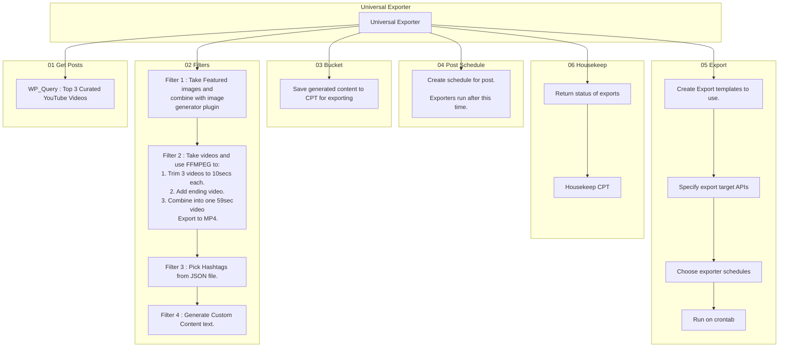

# Universal Exporter

Idea is to have a universal API to export content to various third parties.

## The primary targets are:

- Instagram
- Google My Business
- Custom JSON Formats. (to use for Foundation for Email -> Mailchimp )
- YouTube

## Extra functionality will be:

- Be able to pick any WP_Query to select the input data.
- Transformation steps. This is so I can run any middleware I like. This is to do:
    1. Run the image generator to create any custom imagery I like.
    2. Run any function I like. (e.g. FFMPEG to create new footage to post)
    3. Create hooks to be able to run anything you like.
- Scheduler to schedule the posts at any time / date I like. Also have a 'repeat' function to regularly to the process.
- Reporting on posts.
- Debugging.

## Examples

1. Take the top 3 curated videos in the 'pulse' CPT. 
2. Create a  combined 'stack' graphic with all tree featured images.
3. Use FFMPEG to combine clips from all three videos. Combine, grade, add trailing video.
4. Generate content / tags / title / other info.
5. Combine all data to export and add to schedule.
6. When schedule is ready to post, send to each exporter using their template.
7. Retrieve status and debug info.
8. Housekeep.

## Exporter ideas

### Instagram
Potentially use puppeteer script to post. Especially since API_scraper already uses this.

### YouTube 
Download videos with PHP Script?
Native API to upload

### Google My Business.
Native API (https://developers.google.com/my-business/content/posts-data)

### JSON
Custom exporter. Allow the JSON template to be custom so it can be used alongside the Foundation Email framework to generate newsletters for mailchimp.

### My Usecases

1. Start auto-generating content for youtube from parkourpulse.
    - Daily / Weekly / Monthly auto-posts - with adverts and 'fair usage'
    - https://developers.google.com/youtube/v3/docs/videos/insert

2. Auto-generate content from classes / news to Google My Business
    - https://developers.google.com/my-business/content/posts-data

3. Generate Instagram posts for daily/weekly/monthly content.
    - Pupeeteer script.

4. Pick newsletter content with the Weekly / Monthly top posts and generate JSON